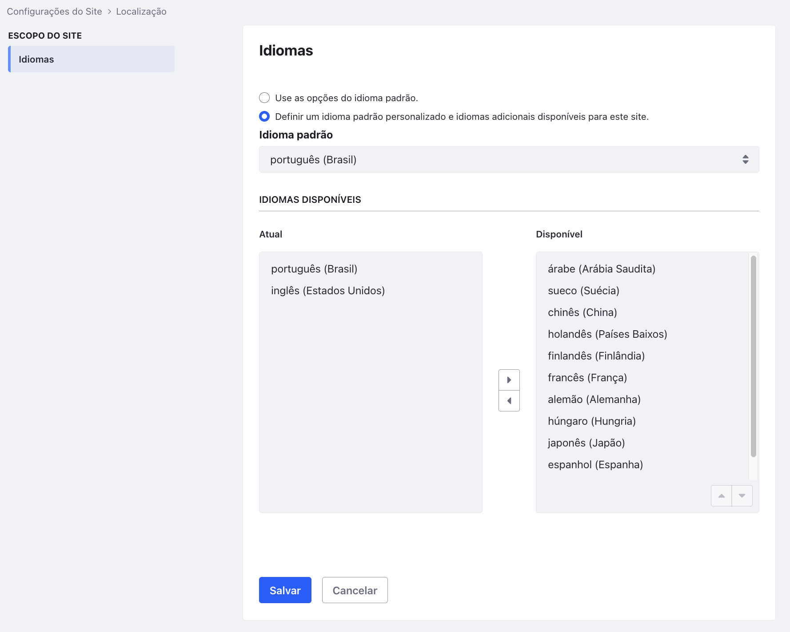

# 2026-04-28 — Multi-idioma PT/EN no site (Task 7)

## O que tentei

- Ativar PT-BR + EN-US no escopo do **Site** Hotel Livingstone (não da Instance) via `Site Administration → Configuration → Site Settings → Localização → Idiomas`.
- Validar fim-a-fim com `curl` que o Liferay roteia URLs com prefixo `/pt-BR/` e `/en-US/`, retorna 404 em locale inativo (`/es-ES/`) e cai em fallback PT-BR sem prefixo.

## O que firmou

- **i18n no Liferay tem 3 níveis** (Instance / Site / Web Content). Ativei no escopo do Site porque o Hotel Livingstone tem público próprio — Instance afetaria sites futuros (intranet, admin) que talvez só sirvam PT.
- **A UI "Atual / Disponível" inverte a intuição.** "Atual" são os idiomas ATIVOS no site (uso permitido); "Disponível" são os idiomas instalados no Liferay mas inativos neste site. Por default o site herda TODOS os idiomas da Instance — restringir é mover pra Disponível.
- **`I18nFilter` parseia o primeiro segmento da URL como locale.** Três estados:
  - sem prefixo (`/web/hotel-livingstone`) → fallback no Default Language (PT-BR), HTTP 200
  - locale ativo (`/pt-BR/...`, `/en-US/...`) → serve nesse idioma, HTTP 200
  - locale inativo/inválido (`/es-ES/...`) → **HTTP 404** explícito (não é silencioso)
- **Análogo Django:** o `LocaleMiddleware` do Django funciona igual. Liferay diferencia "ausência de prefixo" (válido, fallback) de "prefixo de locale não suportado" (erro 404). É por design — servir silenciosamente noutro idioma quebraria contrato de SEO e deep-link.

## Dúvida fechada (vinda da Task 6)

> "A Buscar Page funciona com `/search` técnico, mas o nome de exibição PT-BR é 'Buscar'. Em sites multi-idioma, a friendly URL muda por locale (`/pt-br/search` vs `/en/search`)?"

**Resposta:** não. **Friendly URL é única e estável** por page — independe de locale. O que muda é o **display name** (i18n-aware): em PT renderiza `<title>Buscar - Hotel Livingstone</title>`, em EN renderiza `<title>Search - Hotel Livingstone</title>`. A Search Page tem tradução nativa porque é built-in do core Liferay.

## Descoberta nova — pendência pra M1.2

**Ativar idioma ≠ traduzir conteúdo.** As 6 pages criadas na Task 6 (Home, Quartos, Restaurante, Eventos, Sobre, Contato) têm display name só em PT-BR. Em EN-US, todas renderizam o nome PT — `<title>Quartos - Hotel Livingstone</title>` mesmo acessando `/en-US/web/hotel-livingstone/quartos`. Pra ter site bilíngue de verdade preciso traduzir cada page individualmente. Trabalho de Content Creator → entra em M1.2.

## Screenshot

