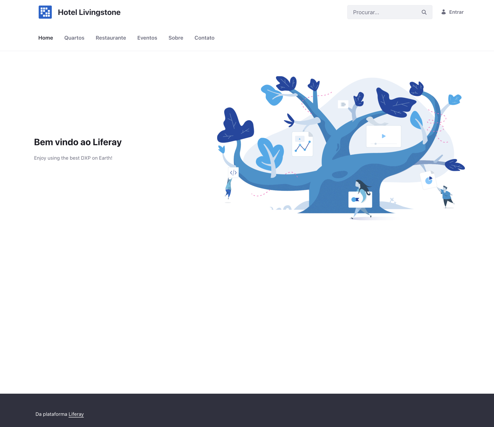

# 2026-04-28 — Navigation Menu Principal (Task 8)

## O que tentei

- Criar Navigation Menu "Principal" com 6 itens (Home, Quartos, Restaurante, Eventos, Sobre, Contato) via `Site Administration → Site Builder → Navigation Menus`.
- Marcar como **Primary Navigation** pra tema padrão renderizar no topo do site.
- Validar fim-a-fim com `curl` e visualmente no browser (logado e deslogado).

## O que firmou

- **Navigation Menu é entidade independente das Pages**, com relação N:M. Pages = unidades de conteúdo/rota; Menu Items = unidades de UX/navegação. Padrão **Composition over Coupling**: site pode ter N menus (Header, Footer, Sidebar), 1 page em vários menus, items que não são pages (URL externa, custom).
- **Primary Navigation conecta menu ao slot do tema.** Sem marcar como Primary, o menu existe no banco mas o tema (Classic, no caso) não sabe que deve renderizá-lo. O slot expõe ao tema via variável FreeMarker (`nav-items` no Classic theme).
- **Permissioning é resolvido em runtime separadamente.** Items de menu que apontam pra page sem permissão View pro user atual são filtrados automaticamente. Por isso a separação Page/Menu existe pra **expressar intenção de UX**, não pra fazer access control.
- **Liferay 7.4 GA132 gera URLs curtas pro Default Site.** O tema renderiza `<a href="http://localhost:8081/quartos">` em vez de `/web/hotel-livingstone/quartos`. Isso só funciona pro Default Site da Instance — sites adicionais (futuros, M2 multi-site) sempre exigem `/web/<friendly-url-site>/<page>`. Ambas as formas roteiam corretamente:

| URL | HTTP |
|---|---|
| `/quartos` (curta) | 200 |
| `/web/hotel-livingstone/quartos` (longa) | 200 |
| `/` (raiz vazia) | 404 |

  Default Site não redireciona `/` automaticamente — precisa explicitar `/home` ou similar.

## Gotcha de validação

- **`curl` retornou 0 ocorrências dos labels** na primeira tentativa porque busquei pelo padrão `>Label<` (texto entre tags). O Liferay envolve labels do menu em `<a class="nav-link text-truncate" href='...' role="menuitem">\n\t\t\t\tLabel\n</a>` — texto vem após whitespace e quebras. Lição: ao validar HTML renderizado por curl, usar regex permissiva primeiro (`grep -oE 'Label'`) antes de assumir que está faltando.

## Implicação pra M2 (multi-site + Docker)

URLs curtas (`/quartos`) hardcoded em conteúdo (Web Content, Fragments, links em texto) **vão quebrar** quando a instância tiver múltiplos sites e Hotel Livingstone deixar de ser Default. Boa prática: sempre referenciar pages internamente via friendly URL do site (`/web/hotel-livingstone/quartos`) ou via macro do tema, nunca via URL curta.

## Screenshot

